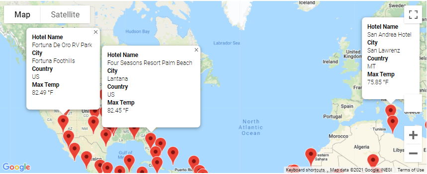

# PlanMyTrip Beta

## Overview of Project
---

PlanMyTrip has enlisted my help to help kickstart a new app that will help their end users better plan out their trips based on the customer's prefered weather conditions. Using the weather and Google APIs, customers are able to input a range of temperatures and the PlanMyTrip app will generate a list of cities that fall within those categories along with local preferred hotels for customer convenience.

## Analysis
---
In order to gather sample data for the beta test, we focussed on the following variables per location.
-   City
-   Latitude
-   Longitude
-   Max Temperature
-   % Humidity
-   % Cloudiness
-   Current Weather Description

## Test Results
---
- After loading the sample city dataset, users are prompted to identify their minimum and maximum temperature preferences. this marrows down the list to cities within the test city set that have current temperatures within the users input range.

Example: User selected temperatures between 75 and 90 Fahrenheit.

-   After selecting their temperature preferences, users are able to explore the map overlay to find a region they would like to visit and build a sample itinerary.

Example: User has selected an itinerary taking them across central Japan.

- Finally, the user is able to review the current weather conditions and prefered hotel accomodations in their selected destinations.

Example: User is able to see details on their selected destinations within their itinerary.

